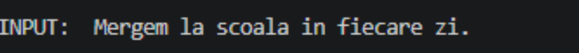
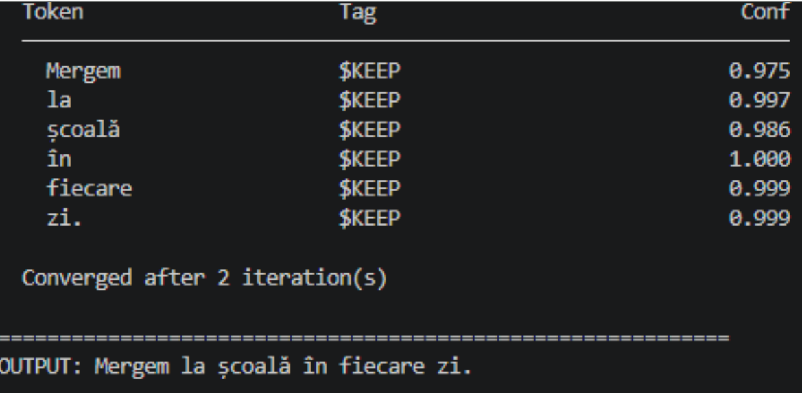
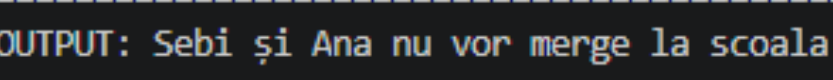
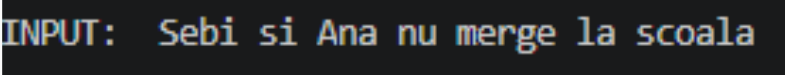
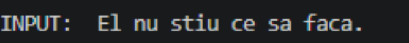
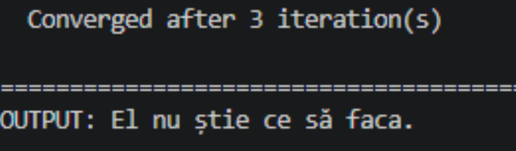

# Language-specific Correction for Romanian using Tag Annotation

keywords: natural language processing, tag annotation, grammar correction, errant, lexicon

## Summary

Natural Language Processing project that reasonably manages to correct erroneous Romanian sentences and words to their grammatically correct forms. The procedure is novel when compared to seq2seq models, as the sentence has the correction itself annotated as a tag (<example>) after the detected misspelt word. This approach is inspired by a method utilized for the English language, which is significantly expanded upon [here](https://github.com/grammarly/gector).

## Dataset

The dataset is made up of approximately 1 million errorful AND correct sentences. The correct sentences are necessary so that the model, during training, can also be privy to examples of grammatically correct forms and words in Romanian. This helps it generalize better. The utilized datasets are [rotexts](https://huggingface.co/datasets/upb-nlp/gec-ro-texts/discussions), [CNA](https://arxiv.org/pdf/2604.23627) and [RoComments](https://huggingface.co/datasets/upb-nlp/gec-ro-comments), together with later additions, [the Leipzig Corpora](https://cls.corpora.uni-leipzig.de/en?corpusLanguage=ron#tblselect) and [Romanian parliamentary debates](https://aclanthology.org/2022.parlaclarin-1.19.pdf). A significant portion of the dataset is also corrupted through simple scripts that ensure proper statistical error distribution.

A condensed view of the statistics can be observed below:
  
| Metric | RoTexts | CNA | RoComments | Leipzig corpora | CDEP |
|---|---:|---:|---:|---:|---:|
| Total | 1,066,114 | 2,463 | 1,978 | 612,607 | 253,655 |
| Identity pairs | 308,205 | 84 | 18 | 120,326 | 48,255 |
| Avg. length of words | 15.6 | 19.1 | 12 | 21.8 | 27.6 |
| Error density | 0.151 edits/token | 0.213 edits/token | 0.446 edits/token | 0.185 edits/token | 0.189 edits/token |

All of these datasets, whether they were synthetically corrupted or whether they were meant as errorful datasets, have sentence-wise pairs between the grammatically incorrect forms and the grammatically correct ones. This is paramount to the next steps in deciding the tag annotations, which will act as labels for the training process.

## Error type acquisition

Considering this correct-incorrect pairing, sentences need to be split between two files that act as input to [ERRANT](https://github.com/teodor-cotet/errant/tree/romanian). ERRANT is crucial to this system, as it spits out error types that are important for the tag acquisition part.

Some errors are not deducible, and so ERRANT may output either wrong classifications or unknown tags, marked as **|||OTHER|||**. Another auxiliary component of this system is the so-called [lexicon, finedtuned on Romanian](https://nl.ijs.si/ME/V6/msd/html/msd-ro.html), that succinctly describes the form of a word (source vs. target): e.g. Vmip3s vs. Vmip2s, which can then be mapped to an ERRANT type classification (such as R:VERB:SVA). This further helps in diversifying error types and deducing those undetected by ERRANT. The final tags are then obtained, using a format of the form: **error-type_word**, where _error-type_ 'tells' the system whether a disagreement between subject and verb is present, a plural form is misspelt and/or there is a problem with the word order, and where _word_ represents the correct form of the word. As such, a direct mapping between incorrect and correct forms is made.

3702 classes are obtained (compared to the system from which this one was inspired, that had ~5000). A glimpse into the class distribution can be seen here, with the top 7 classes in terms of examples:

| Error type | Number | Percentage |
|---|---:|---:|
| R:SPELL | 2,353,741 | 59.08% |
| R:OTHER | 296,565 | 7.44% |
| M:PUNCT | 189,527 | 4.76% |
| U:PUNCT | 181,819 | 4.56% |
| R:WO | 165,942 | 4.16% |
| R:NOUN | 160,445 | 4.03% |
| R:NOUN:FORM | 125,495 | 3.15% |

A significant imbalance is present. As such, weighted Cross-Entropy Loss and square root inverse frequency class weights are both utilized to offset the side-effects as much as possible.

## Training 

A pretrained model for Romanian is used for tokenization: [dumitrescustefan/bert-base-romanian-cased-v1](https://huggingface.co/dumitrescustefan/bert-base-romanian-cased-v1).

10 epochs were deemed appropriate, with a PATIENCE of 3 and 2 COLD EPOCHS where the encoder is frozen. The bulk of the combined dataset was used for training, whereas validation had around 10.000 sentences. 

## Performance

On the combined test set, the following metrics were obtained:

| Metric | Result |
|---|---:|
| Test loss | 0.1432 |
| Test F1 | 0.8045 |
| Test Precision | 0.8301 |
| Test Recall | 0.7804 |

When doing an analysis on each of the first three datasets, we get:

| Test set | Iteration | F0.5 |
|---|---:|---:|
| CNA | 1 | 0.42 |
| CNA | 2 | 0.40 |
| CNA | 3 | 0.41 |
| RoComments | 1 | 0.66 |
| RoComments | 2 | 0.64 |
| RoComments | 3 | 0.64 |
| RoTexts | 1 | 0.53 |
| RoTexts | 2 | 0.50 |
| RoTexts | 3 | 0.51 |

This system manages to beat the [SotA](https://www.mdpi.com/2078-2489/16/3/242) (all iterations) on RoComments.

## Examples

<table>
  <tr>
    <th>Original</th>
    <th>After iteration</th>
  </tr>

  <tr>
    <td align="center">
      
    </td>
    <td align="center">
      
    </td>
  </tr>

  <tr>
    <td align="center">
      
    </td>
    <td align="center">
      
    </td>
  </tr>

  <tr>
    <td align="center">
      
    </td>
    <td align="center">
      
    </td>
  </tr>
</table>
